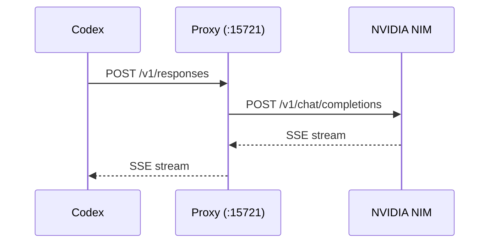

<div align="center">

# Codex NIM Proxy

**让 Codex 白嫖 NVIDIA 免费顶级模型：DeepSeek V4.1 Flash、GLM-5.3、Kimi K3 开箱可用**

Codex 说 Responses API，NVIDIA NIM 说 Chat Completions —— 本项目在中间做协议转换。
Use Codex with NVIDIA's free top-tier models — a local Responses ↔ Chat Completions bridge.


[快速开始](#快速开始) · [支持的模型](#支持的模型) · [功能](#功能) · [架构](#架构) · [常见问题](#常见问题)

</div>

## 快速开始

前置条件：

- Node.js 18 或以上
- Codex（CLI 或桌面版）已安装
- 一个免费的 [NVIDIA NIM API Key](https://build.nvidia.com/explore/discover)

```bash
git clone https://github.com/ClaireMoonlit/codex-nvidia-proxy.git
cd codex-nvidia-proxy

copy .env.example .env      # 然后把你的 NVIDIA_API_KEY 填进 .env
node responses_proxy.cjs
```

Windows 用户也可以直接双击 `start_proxy.bat`。

代理启动时会自动备份并接管 `~/.codex/config.toml`（把 `model_provider` 指向本地代理），并写入 Codex 的模型目录，**不需要手改任何配置**。启动后打开 Codex 就能选模型：桌面版在模型下拉框里选，CLI 用 `/model`。

关掉代理（在启动它的窗口按 `Ctrl+C`）会自动还原原始配置，Codex 回到只用 OpenAI 官方模型的状态。

## 支持的模型

不用记模型名。代理每次启动都会从 NVIDIA 拉取当前可用的全部模型，写进 Codex 的 `model-catalog.json`，`/model` 和桌面版下拉框里直接可选。

下面是 2026-09 实测可用的代表性模型：

| 模型 | 适合用来做 |
|------|-----------|
| DeepSeek V4.1 Flash | 日常编码、快速改 bug，响应快 |
| Kimi K3 | 读大项目、长上下文任务 |
| GLM-5.3 / GLM-5.3 Flash | 中文场景友好，推理与 agent 任务 |
| Nemotron 3 Ultra 550B | NVIDIA 旗舰，复杂推理 |
| Nemotron 3 Super 120B | 综合均衡，工具调用稳定 |
| Nemotron 3.5 Lightning 30B | 轻量高速，简单任务够用 |
| Gemma 4 31B | Google 通用模型 |
| Mistral Large 2 | Mistral 旗舰 |
| gpt-oss 20B | OpenAI 开源模型 |
| Llama 3.2 90B Vision | 支持看图，能读截图 |

NVIDIA 会不时上架和下架模型，所以以 Codex 客户端里显示的实时列表为准，本表不保证长期准确。

## 功能

- **协议透明转换** — Codex Responses API ↔ NVIDIA Chat Completions 的全字段映射，流式（SSE）与非流式都支持，思考过程和正文分离显示
- **工具调用完整支持** — function tool、Codex 的 `namespace` 分组工具（MCP 服务器工具、子代理工具）、自由格式工具（`apply_patch`，无 JSON Schema）都能正确往返，调用结果按 Codex 的路由格式回填；CLI 与桌面版均已实测
- **指令角色兼容** — Codex 下发的 `developer` 消息会映射成 NIM 认识的 `system`，技能说明不会丢
- **托管 Web 搜索** — Codex 发起 `web_search` 时代理代为执行并回填结果
- **模型目录实时同步** — 启动时从 NIM 拉取可用模型并过滤掉非对话模型，写入 Codex 模型目录
- **配置自动来回** — 启动接管、退出还原，不留残留
- **失效模型自动屏蔽** — 返回 404 的模型自动移出列表（想重新测就删 `model_blacklist.json` 再重启）
- **自动重试** — 网络抖动或服务繁忙时自动重试
- **零依赖单文件** — 只用 Node.js 内置模块，不需要 `npm install`

## 架构



- 单文件 [`responses_proxy.cjs`](./responses_proxy.cjs)，零外部依赖，纯 Node.js 内置模块
- 监听 `http://127.0.0.1:15721`
- 流式请求首轮带 3 秒心跳，避免客户端长时间静默显示"重连中"
- 上游 socket 超时 300s

## 环境变量

| 变量 | 说明 | 默认值 |
|------|------|--------|
| `NVIDIA_API_KEY` | NVIDIA NIM API Key，**必需** | 无 |
| `DEBUG` | 打印详细调试日志（需设为 `true`） | `false` |

## 常见问题

**模型列表里没有刚上架的新模型？**
Codex 只在启动时读一次模型列表，重启 Codex 客户端即可看到。

**`/model` 里看不到 NIM 模型？**
先确认代理还活着（`http://127.0.0.1:15721` 有响应），再用 `codex debug models` 看 CLI 实际加载到的目录。

**提示额度不足或请求被拒？**
通常是这个 NVIDIA 账号的免费额度用完了，换一个 Key 或稍后再试。

**怎么确认代理真的在工作？**
在 PowerShell 里跑下面这条命令，能看到滚动输出的 `data:` 就说明通了：

```powershell
$body = '{"model":"z-ai/glm-5.3-flash","input":[{"role":"user","content":"Say the single word: pong"}],"stream":true}'
Invoke-WebRequest -Uri http://127.0.0.1:15721/v1/responses -Method POST -Body $body -ContentType "application/json"
```

## 项目结构

```
codex-nvidia-proxy/
├── responses_proxy.cjs    # 主代理（单文件，零依赖）
├── start_proxy.bat        # Windows 启动脚本
├── .env.example           # API Key 配置模板
├── models.json            # 内置兜底模型列表（拉不到实时列表时才用）
├── model_state.json       # 当前选中的模型（自动生成）
├── model_blacklist.json   # 不可用模型黑名单（自动生成）
├── package.json           # 项目元数据（无外部依赖）
└── LICENSE
```

## 许可

MIT License，详见 [LICENSE](./LICENSE)